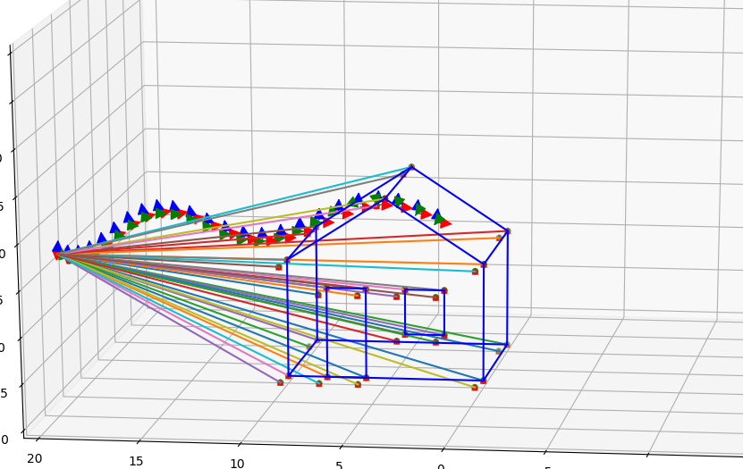

# Simulating the Viusal Inertial Odometry (VIO) data

Simulating the Inertial Measurements Unit's and the camera's data to test the VIO algorithm. Our experiment szenario is a house, see following picture. You can change the configuration of the house by editing the "house.txt" in "bin/house_model". The default movement of IMU and camera is crcle movement around the house, feel free to change the movement by editing the function "MotionModel" in "imu.cpp".

Our example:
<p align="middle">
	
</p>

## Installation

### Linux Ubuntu 16.04

Install OpenCV, C++

A few updates to the instructions above were needed.

```bash
$> cd ~
$> git clone https://github.com:chengKID/VIO_Data_Simulation.git
$> cd VIO_Data_Simulation
$> cmake .
$> make
$> ./bin/data_gen
```

## Pyton Tools
	There are some python scripts in directories "phyton_tool". Feel free to use this small tools to draw trajectory, evaluation historgram, and so on.
